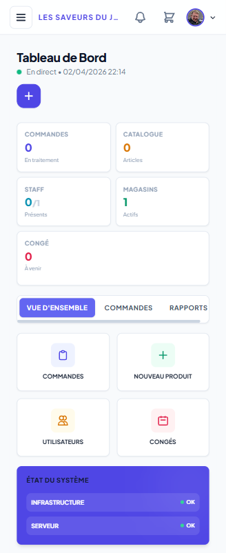

# Les Saveurs Du Jardin (LSDJ) - Enterprise Management Portal

[](https://github.com/ArmSal/les-saveurs-du-jardin/actions)
[](https://symfony.com)
[](https://www.docker.com/)
[](https://grafana.com/)

## Executive Summary
**Les Saveurs Du Jardin (LSDJ)** is a high-performance Enterprise Resource Planning (ERP) portal designed for multisite retail management. It centralizes Human Resources, Logistics, and General Administration into a unified, secure, and scalable platform. 

This project serves as a comprehensive demonstration of enterprise-grade architecture, implementing advanced CI/CD pipelines, containerized micro-services, and real-time infrastructure monitoring.

## Key Business Modules

### Human Resources & Workforce Management
*  **Dynamic Rostering**: Real-time employee schedule management with conflict detection.
*  **Leave Management**: Automated workflow for leave requests, approvals, and electronic signatures.
*  **HR Vault**: Secure digital storage for employee contracts and sensitive documentation.

### Logistics & Supply Chain
*  **Inventory Control**: Centralized product catalog with multi-criteria filtering.
*  **Order Management**: Full lifecycle tracking of internal and external orders.
*  **Fleet Tracking**: Logistics module for managing truck deliveries and maintenance schedules.

### Security & Governance
*  **RBAC (Role-Based Access Control)**: Granular permission system with 6 distinct access levels per module.
*  **Electronic Signature**: Legal-grade digital signature integration for internal validations.
*  **Audit Logging**: Comprehensive tracking of critical business events.

---

## User Interface Experience
The portal features a modern, responsive interface optimized for Desktop, Tablet, and Mobile devices.

| Desktop View | Tablet View | Mobile View |
| :--- | :--- | :--- |
|  |  |  |

---

## Technical Architecture

### Core Stack
*  **Engine**: Symfony 7.4 LTS (PHP 8.2.30)
*  **Storage**: MySQL 8.0 (Relational Data)
*  **Interface**: Twig Template Engine + Tailwind CSS (JIT)
*  **Reporting**: Dompdf Engine for professional PDF generation.

### DevOps & Infrastructure

This platform implements the three pillars of modern infrastructure:

1. **Infrastructure as Code**: Automated provisioning and deployment targeting Cloud environments.
2. **CI/CD Pipeline**: Robust GitHub Actions workflow including:
  *  Automated PHPUnit testing (Security & Auth routes)
  *  Trivy container vulnerability scanning
  *  Docker image build & GHCR registry push
3. **Observability & Monitoring**:
  *  Prometheus for host & container metrics scraping
  *  Grafana for real-time visualization of system and application health.
  *  **Alerting**: Configured thresholds (CPU, RAM, Disk) for critical performance indicators.

---

## Deployment & Installation

### Prerequisites
*  Docker & Docker Compose
*  Git

### Quick Start (Windows 11)
You can set up and run the environment automatically using the provided PowerShell scripts:

```powershell
# 1. Check your local prerequisites (Git, Docker)
.\scripts\provision\install_dependencies.ps1

# 2. Setup your local environment files and run Docker Compose
.\scripts\provision\setup_project.ps1

# 3. Verify that all micro-services are healthy and reachable
.\scripts\verify\check_services.ps1
```

### Manual Quick Start (Linux/macOS)
```bash
# Clone the repository
git clone https://github.com/ArmSal/les-saveurs-du-jardin.git

# Navigate to the docker directory and launch the containers
cd docker
docker compose up -d --build
```

### Accessing the Local Services
Once the containers are running, you can access the interfaces below:
*  **Web Portal**: [http://localhost:80](http://localhost:80)
*  **Database Management (Adminer)**: [http://localhost:8081](http://localhost:8081)
*  **Monitoring (Grafana)**: [http://localhost:3000](http://localhost:3000)
*  **Prometheus UI**: [http://localhost:9090](http://localhost:9090)
*  **Alertmanager**: [http://localhost:9093](http://localhost:9093)
*  **cAdvisor (Docker Metrics)**: [http://localhost:8082](http://localhost:8082)
*  **Node Exporter**: [http://localhost:9100](http://localhost:9100)

---

## Project Documentation
Detailed technical specifications and architectural diagrams are available in the `/docs` directory:
*  📄 [Technical Specifications (CDC)](docs/CAHIER_DES_CHARGES.md)
*  📊 [Architecture Schema](docs/architecture_schema.md)
*  🚀 [Deployment Guide](docs/DEPLOIEMENT.md)
*  🛡️ [Security Documentation](docs/SECURITE.md)
*  📈 [Supervision & Monitoring](docs/SUPERVISION.md)
*  ☁️ [AWS EC2 Configuration Guide](docs/config_ec2_aws.md)

---

## Authors & License
Developed by **[ArmSal](https://github.com/ArmSal)**. 
Distributed under the MIT License.

