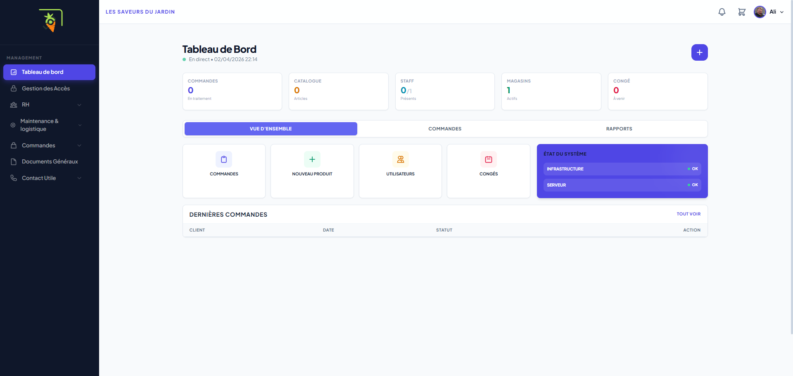
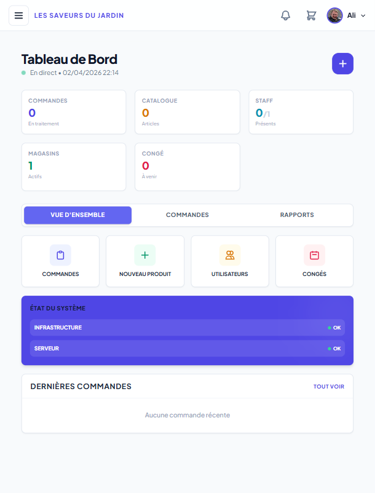

# 🌿 Portail LSDJ - Les Saveurs Du Jardin

[](https://github.com/ArmSal/les-saveurs-du-jardin/actions)
[](https://opensource.org/licenses/MIT)
[](https://symfony.com)
[](https://docker.com)

**Portail LSDJ** est une plateforme web interne de gestion multi-magasin centralisant les ressources humaines, la logistique et l'administration pour l'entreprise **Les Saveurs Du Jardin**.

---

## 🚀 Vision du Projet

Conçu pour répondre aux défis d'une entreprise multisite en pleine croissance, le Portail LSDJ offre une solution exhaustive pour :
- 👥 **Gestion RH** : Congés avec workflow de validation, plannings dynamiques et signatures électroniques.
- 📦 **Logistique & Vente** : Catalogue produits multi-critères et gestion complète des commandes.
- 📂 **Gestion Documentaire** : Coffre-fort numérique avec permissions granulaires.
- ⚡ **Notifications** : Système d'alerting en temps réel pour tous les événements métier.

---

## 🛠️ Stack Technique & Architecture

- **Backend** : Symfony 6.4 / 7.0 (PHP 8.2) | Doctrine ORM
- **Database** : MySQL 8.0
- **Frontend** : Twig | Tailwind CSS | JavaScript (Turbo/Stimulus)
- **Security** : RBAC (Role-Based Access Control) avec **6 niveaux de permissions** par module.
- **Reporting** : Dompdf (Génération de PDF) | KnpPaginator (Pagination)

---

## 🏗️ Écosystème DevOps (Parcours ASD)

Ce projet implémente les piliers du titre **Administrateur Systèmes DevOps** :
- **BC01 - Infrastructure** : Déploiement automatisé ciblant le Cloud Public (IaC).
- **BC02 - CI/CD** : Pipeline robuste via GitHub Actions incluant tests unitaires, analyse statique et build Docker.
- **BC03 - Supervision** : Monitoring de l'application et de l'infrastructure via Prometheus & Grafana.

---

## 🎨 Maquettes de l'Interface

Voici les visuels de l'interface **Les Saveurs Du Jardin** pour les différents terminaux :

| Desktop | Tablette | Mobile |
| :--- | :--- | :--- |
|  |  |  |

---

## 📂 Documentation de Référence

- 📄 **[Cahier des Charges Détaillé](CAHIER_DES_CHARGES.md)**
- 📝 **[Méthodologie de Gestion de Projet](docs/METHODOLOGY.md)**
- 🏗️ **[Modèle de Données & Relations](docs/DATABASE_MODEL.md)**

---

## ⚙️ Installation Rapide (Docker)

```bash
# Cloner le projet
git clone https://github.com/ArmSal/les-saveurs-du-jardin.git

# Lancer l'environnement de développement
docker-compose up -d --build

# Initialiser la base de données (une fois le conteneur prêt)
docker-compose exec app php bin/console doctrine:migrations:migrate
```
*Accès : `http://localhost:8080` | Base de données : `8081` (Adminer)*

---

## ⚖️ Système de Permissions Granulaire

Le portail utilise un système d'accès unique :
1. `AUCUN_ACCES`
2. `ACCES_PERSONNEL` (Données propres)
3. `LECTURE_MAGASIN` (Scope site uniquement)
4. `LECTURE_TOTALE` (Scope entreprise)
5. `ADMIN_MAGASIN` (Gestion locale)
6. `ACCES_TOTAL` (Super-Administration)

---

## 🤝 Contribution & Évaluation

Ce projet est réalisé par **[ArmSal](https://github.com/ArmSal)** dans le cadre du titre professionnel **ASD**.
Contact : https://github.com/ArmSal
