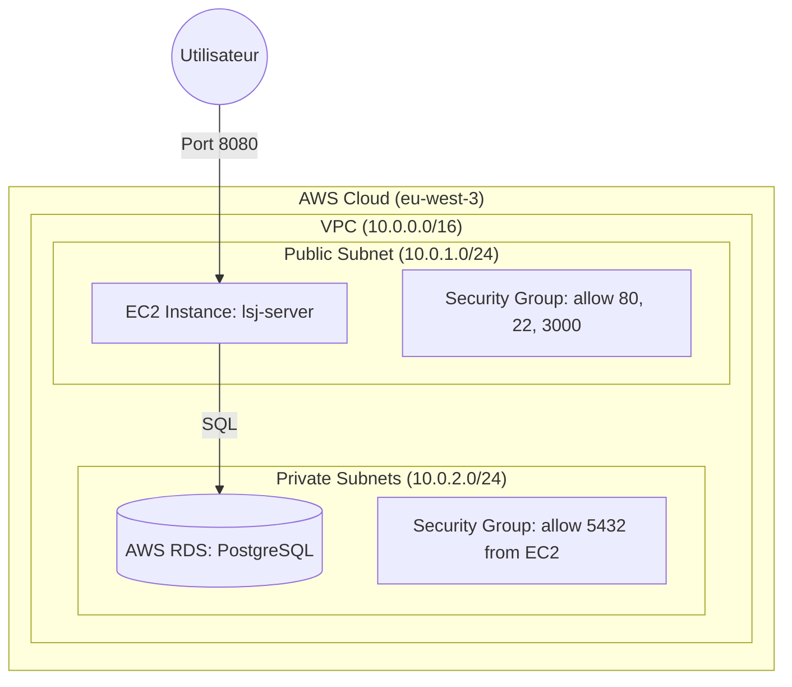
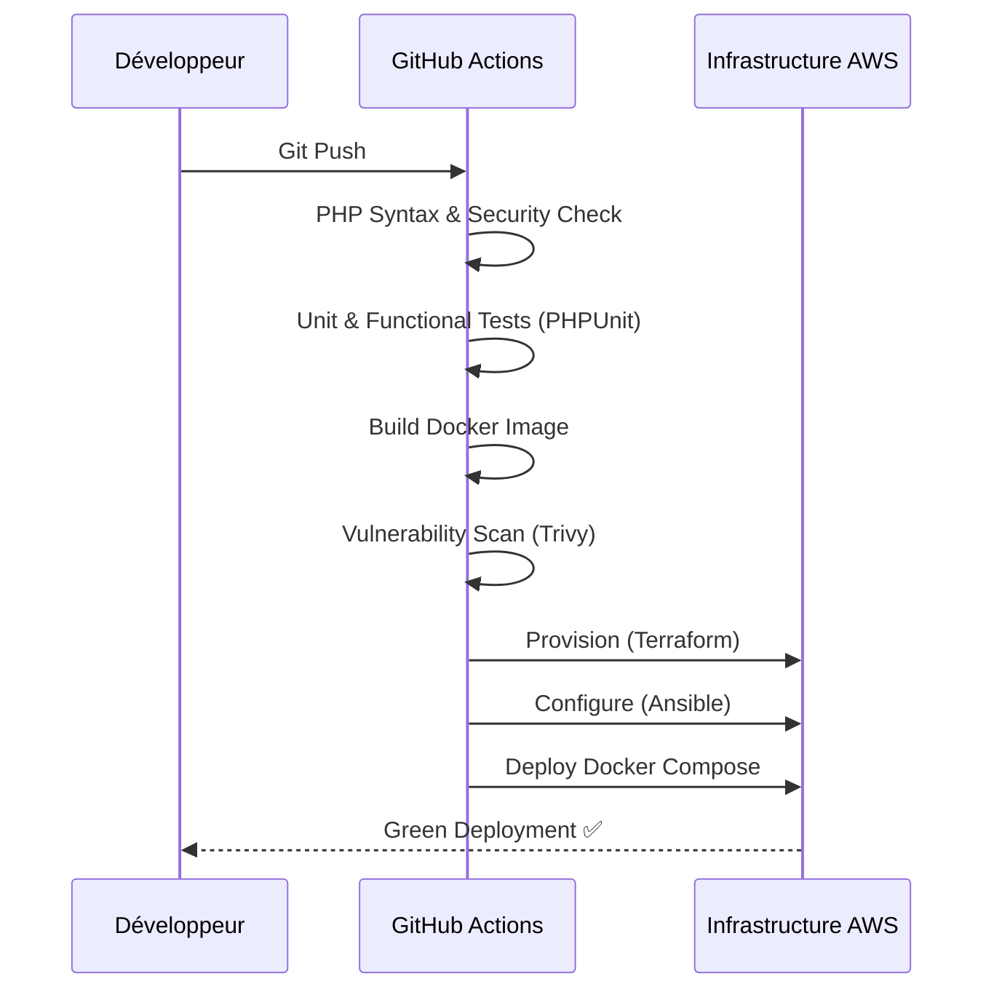

# Architecture Technique - LSDJ

## 🏗️ 1. Infrastructure Cloud (AWS)
L'infrastructure est provisionnée via **Terraform** sur AWS.

## 🚀 2. Pipeline CI/CD & Déploiement
Le flux de livraison est automatisé via **GitHub Actions**.

## 📊 3. Système de Supervision (BC03)
La pile de monitoring est hébergée sur l'EC2 via Docker.

*   **Prometheus** : Collecte les métriques (Scraping).
*   **Grafana** : Visualisation des données (Dashboards).
*   **Node Exporter** : Métriques système (CPU, Disque, RAM).
*   **Alerting** : Seuils critiques configurés (CPU > 80%, Disque > 90%).
